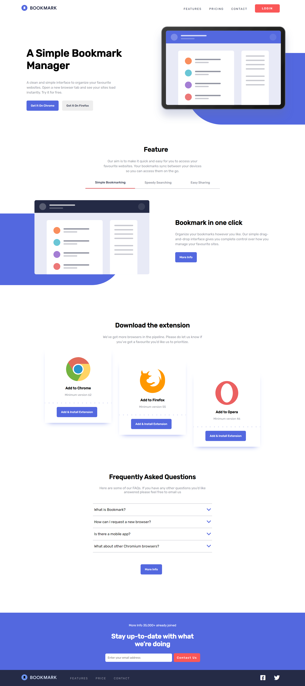

# Bookmark landing page

## Table of contents

- [Overview](#overview)
  - [The challenge](#the-challenge)
  - [Screenshot](#screenshot)
  - [Links](#links)
- [My process](#my-process)
  - [Built with](#built-with)
  - [What I learned](#what-i-learned)
  - [Continued development](#continued-development)
  - [Useful resources](#useful-resources)

## Overview

### The challenge

Users should be able to:

- View the optimal layout for the site depending on their device's screen size
- See hover states for all interactive elements on the page
- Receive an error message when the newsletter form is submitted if:
  - The input field is empty
  - The email address is not formatted correctly

### Screenshot



### Links

- Live Site URL: [bookmark-live-demo](https://your-live-site-url.com)

## My process

### Built with

- Semantic HTML5 markup
- CSS custom properties
- Flexbox
- SASS
- Mobile-first workflow
- JavaScript DOM manipulation

### What I learned

In this project I learned how to make accordion and use css filter property for changing color of image

To see how you can add code snippets, see below:

```css
.logo {
  filter: saturate(0.86) hue-rotate(170deg) invert(100%);
}
```

### Continued development

I will pay more attention to the css positions and layout structure in future projects

### Useful resources

- [window resize](https://developer.mozilla.org/en-US/docs/Web/API/Window/resize_event) - This helped me for displaying hamburger menu icon small screen size. I really liked this pattern and will use it going forward.
